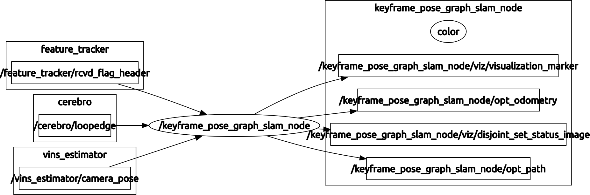

# Node for pose graph optimization.

This node actually builds up the graph of poses incrementally using odometry edges and loopclosure edges.
It also can handle kidnap and random failure. This is accomplished by keeping track of multiple
co-ordinate systems and relative poses between the co-ordinate system. Finally whenever new loopclosure
edges are available, the pose graph is solved. The switching constraint formulation
as detailed in *Sünderhauf N, Protzel P. Switchable constraints for robust pose graph SLAM. In2012 IEEE/RSJ International Conference on Intelligent Robots and Systems 2012 Oct 7 (pp. 1879-1884). IEEE.* is used.

To get a simplistic theoritical understanding of the pose graph solver, I suggest to look at this : [HERE](https://kusemanohar.wordpress.com/2017/04/29/howto-pose-graph-bundle-adjustment/)

This is intended to be run with [Cerebro](https://github.com/mpkuse/cerebro) and VINS-Fusion.

Defines 2 classes
### NodeDataManager:
This class holds all the data. Including node data and
critical edge data. Later on can have more data if need be.
Crititcal data include: i) VIO poses at each keyframes. ii) Edge poses.

### PoseGraphSLAM:
This class holds the pointer to an object of class NodeDataManager.
All the functions related to ceres-solver here. It is intended to be run in a separate thread.
The thread triggers on seeing new loopedges. On trigger it does:
1. Allocate new opt variables (if need be)
- Add Loop Edges Residue Term to Ceres::Problem
    - Loop Edges (intra world)
    - Loop edges (inter world)
- Add Odometry Residues to Ceres::Problem
- Initial Guesses for the nodes
- Mark 1st nodes of each worlds as constant with Node Regularization
- ceres::Solve()


### main (keyframe_pose_graph_slam_node.cpp)
This contains the main. It calls a visualization publisher in 1 thread. In another thread `PoseGraphSLAM::reinit_ceres_problem_onnewloopedge_optimize6DOF()` is called.
The main thread handles the ros-callback. Subscribes to `/vins_estimator/camera_pose` and `/cerebro/loopedge`.
It publishes the corrected pose as Ros Visualization Marker.

The visualization marker is a `LINE_STRIP` at all pose. Different colors of the trajectory denote
different co-ordinate systems.

## Dependencies
- ceres-solver
- Eigen3
- OpenCV 3 (only used for visualization)
- [Cerebro pkg](https://github.com/mpkuse/cerebro) (for definations of LoopEdgeMsg)

## Compile and Run
```
cd catkin_ws/src
git clone https://github.com/mpkuse/solve_keyframe_pose_graph
cd catkin_ws
catkin_make

rosrun solve_keyframe_pose_graph keyframe_pose_graph_slam
```



## Author
Manohar Kuse <mpkuse@connect.ust.hk>
